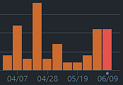

# 2024년 1학기 스마트폰 게임 프로그래밍 프로젝트

## Space Clicker

## 1. 게임 컨셉

_**장르**_: 방치형, 클리커, 업적 수집

_**핵심 메카닉**_: 클릭을 통해 자원을 획득하고, 업그레이드를 통해 자원 획득량을 증가시키는 방치형 게임

_**컨셉**_: 우주선을 타고 클릭을 통해 스크랩을 수집해 우주선을 업그레이드하고 점점 더 멀리 나아가는 방치형 게임

*클리커 게임 대표 예시 - [Cookie Clicker]*

*게임에서 사용할 에셋 예시*

---

## 2. 개발 범위

### 메인 게임

- 자동으로 화면이 스크롤 되면서 우주선이 전진(무한 스크롤)
- 클릭을 통해 스크랩을 수집
- 화면에 현재 자원이나 속도 표시 및 업그레이드 페이지로 이동 가능한 UI
- 업그레이드된 요소 화면에 표시
  - e.g. 안테나 업그레이드 시 우주선에 안테나가 추가됨
- 랜덤 이벤트(미니게임) 2종
  - 소행성 지대 통과: 날아오는 소행성을 피해 우주선을 조종해 통과
  - 적과 전투: 간단한 탄막 슈팅 게임을 진행

### 업그레이드

- 스크랩을 통해 업그레이드 할 수 있는 3개의 항목
- 기지로 복귀를 통해 이동거리에 따른 업적 획득 및 초기화, 영구 업그레이드 획득
  - 우주선 변경

#### 업그레이드 종류

- *스크랩 획득량 업그레이드*
  1. 안테나
      - 클릭 시 획득되는 스크랩량(CS)을 증가시킵니다.
      - 최초 가격: 15 S(스크랩)
      - 효과: CS +0.5
  2. 로봇 팔
      - 자동으로 획득되는 스크랩(SPS, ScrapPerSec)을 증가시킵니다.
      - 최초 가격: 50 S
      - 효과: SPS +0.5
  3. 재활용 기계
      - SPS를 증가시킵니다.
      - 최초 가격: 100 S
      - 효과: SPS +0.5

- *우주선 속도 업그레이드*
  1. 엔지니어 고용
      - 최초 가격: 100 S
      - 효과: +0.1km/s
  2. 엔진 업그레이드
      - 최초 가격: 1,000 S
      - 효과: +0.5km/s
  3. 유선형 설계
      - 최초 가격: 10,000 S
      - 효과: +1km/s

### 업적

- 이동 거리나, 속도, 자원 수집량에 따른 업적 20종
- 업적을 모아서 볼 수 있는 페이지

#### 업적 종류

1. 안테나를 최초로 구매합니다.
2. 로봇 팔을 최초로 구매합니다.
3. 재활용 기계를 최초로 구매합니다.
4. 엔지니어를 최초로 고용합니다.
5. 엔진을 최초로 구매합니다.
6. 유선형 설계를 최초로 구매합니다.
7. 7,777,777개의 스크랩을 획득합니다.
8. 1AU(1억 5천만 km) 거리를 이동합니다.
9. 30AU(45억 km) 거리를 이동합니다.(해왕성)
10. 202억 km 거리를 이동합니다.(보이저 2호)
11. 242억 km 거리를 이동합니다.(보이저 1호)
12. 우주 해적을 격파합니다.
13. 소행성 지대를 통과합니다.
14. 소행성과 충돌합니다.
15. 11.2km/s 에 도달합니다.(탈출속도)
16. 1000SPS에 도달합니다.
17. 100km/s 에 도달합니다.
18. 기지로 복귀합니다.
19. 화면을 10,000번 터치합니다.
20. 게임이 꺼진 상태에서 1,000,000 km 거리를 이동합니다.

### 백그라운드 동작

- 게임 종료 후에도 업그레이드 상황에 따라 자동으로 자원 수집 및 우주선 전진
  - 게임 종료 시간을 저장하고 다시 시작할 때 이를 기준으로 자원 수집량 계산
  - 이동거리도 마찬가지로 계산
- 랜덤 이벤트나 업적 달성, 자원 수집량에 도달 시 알림

---

## 3. 게임 실행 흐름

- 클릭을 통해 우주의 스크랩을 수집한다.
- 수집한 스크랩으로 우주선을 업그레이드한다.
- 업그레이드를 통해 우주선의 속도와 자원 자동 수집량을 증가시킨다.
- 게임을 초기화(지구로 복귀)하는 대신 영구적인 업그레이드(우주선 변경 등)와 업적을 주는 이벤트를 추가한다.
- 게임을 종료해도 백그라운드에서 업그레이드 상황에 따라 게임이 진행된다.
- 자원 수집이나 우주선 속도, 이동거리 또는 임의의 이벤트에 따라 업적을 달성할 수 있다.

---

## 4. 개발 일정

### git insights

| 0주차 | 1주차 | 2주차 | 3주차 | 4주차 | 5주차 |
| :---: | :---: | :---: | :---: | :---: | :---: |
| 4 | 12 | 3 | 18 | 3 | 4 |

*0주차 프로젝트 생성 및 발표 준비*

### 1주차 (100%)

- 메인 화면 구성
  - 화면에 우주선 이미지를 배치하고, 클릭 시 스크랩을 획득하는 기능 구현
  - 화면에 스크랩 수량을 표시하는 UI 구현
  - 자동으로 스크랩을 수집하는 기능 구현

### 2주차 (100%)

- 우주선이 자동으로 전진하는 것처럼 보이는 화면 구성
  - 화면 스크롤 기능 구현
  - 중간에 임의로 스크랩 이미지나 행성 이미지가 지나가도록 배치
- 우주선 이동 속도와 이동 거리를 표시하는 UI 구현

### 3주차 (75%)

- 업그레이드 및 업적 확인 버튼 구현
- *업그레이드 및 업적 화면 구현* (50%, 업적 화면 미구현)
- *업그레이드 팝업화면 구현* (Toast로만 구현, 팝업 클래스 구현 예정)
- 자원 수집 업그레이드 시 자동으로 자원 수집량 증가하는 것 구현

### 4주차 (50%)

- 업적 구현
  - *업적을 달성하면 업적 화면에 팝업으로 표시하는 기능 구현* (Toast로만 구현, 팝업 클래스 구현 예정)
  - 게임 내 어떤 수치가 일정 수준에 도달할 때마다 업적 달성

### 5주차 (10%)

- 랜덤 이벤트(미니게임) 기반 구현
  - 이벤트 발생 조건 설정
  - 이벤트 발생 시 화면 전환 구현
- 랜덤 이벤트(미니게임) 1종 구현 

### 6주차

- 랜덤 이벤트(미니게임) 나머지 1종 구현

### 7주차

- 저장, 불러오기 기능 구현
- 백그라운드 동작 구현
  - 저장된 게임 데이터를 기반
  - 게임 종료 후에도 자동으로 자원 수집 및 우주선 전진해 불러올 때 반영

### 8주차

- 백그라운드 동작 구현2
  - 게임을 종료한 사이 랜덤 이벤트가 발생하면 알림
  - 일정 수치만큼 자원을 수집하거나 플레이어가 설정한 수집량에 도달하면 알림

### 9주차

- 최종 데모 제작
- *여유일정*
  - *혹여나 중간에 일정이 밀린 경우를 대비*

---

## 5. 주요 클래스 구성

### Player

- Scrap과 SpaceShip, Achievement 클래스를 가진 클래스
- Singleton 패턴을 사용해 하나의 인스턴스를 모든 클래스에서 접근해 사용
- draw
  - 스크랩의 수량과 우주선의 속도, 이동 거리, 우주선을 화면에 그림
- update
  - 스크랩 수집, 우주선 이동, 업적 달성 여부를 확인
- onClick
  - 우주선을 클릭 시 스크랩 클래스에 있는 클릭 당 스크랩 수만큼 스크랩을 획득
- onUpgrade
  - 업그레이드 씬에서 업그레이드를 클릭할 때 호출

#### Scrap

- 스크랩의 수량을 관리하는 클래스
- 스크랩의 현재 수량과 클릭 당 스크랩 수집량, 자동 수집량을 관리
- Player 내부에서 SpaceShip과 상호작용
- draw
  - ImageNumber 클래스 객체를 내부에 생성해 사용
  - 스크랩의 수량과 자동 스크랩 수집량을 화면에 그림

#### SpaceShip

- 우주선의 속도, 이동 거리를 관리하는 클래스
- 기본적은 우주선을 그리는 역할도 수행
- draw
  - 화면 중앙에 우주선을 그림
  - 우주선의 속도와 이동 거리를 화면에 표시

*Scrap과 SpaceShip은 각각의 업그레이드 정보를 저장하고 있음*

#### Achievement

- 업적을 관리하는 클래스
- 업적 달성 여부를 확인하고, 달성 시 업적 화면에 표시
- 업적의 이름과 설명을 string.xml로 저장해 사용
  - 지역에 따른 다른 언어 표시 지원예정

### Button, ITouchable

- 게임 내에 터치 가능한 객체를 관리하는 인터페이스
  - 현재 Button과 Player가 ITouchable을 상속받음
- Scene에 객체를 추가할 때 ITouchable을 상속받은 객체이면 터치 리스트에 추가
- onTouch 메소드가 호출되면 리스트에 있는 모든 객체의 onTouch 메소드를 호출
- Button은 ITouchable을 상속받아 터치 가능한 객체를 생성
  - Button을 생성할 때 onTouch 메소드를 Override하여 터치 시 동작을 정의

### ImageNumber

- Sprite를 상속받은 클래스로 숫자를 이미지로 표현
- 숫자를 화면에 표시할 경우가 많아 클래스를 만들어 관리
